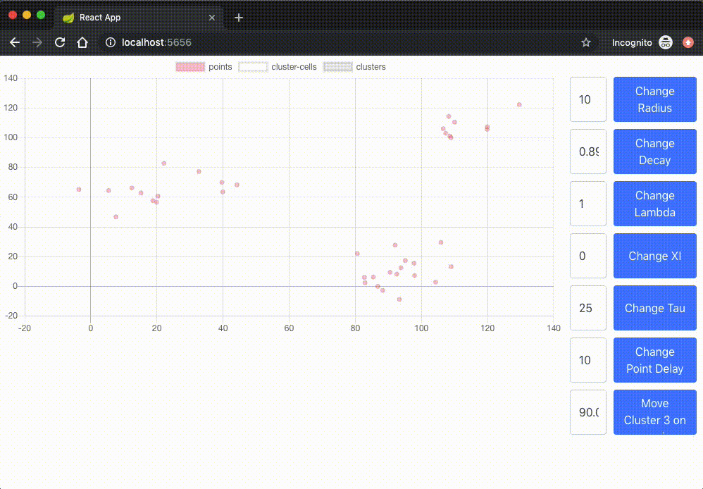

# ClusteringStreamData-Kafka

Reimplementation of the paper "Clustering Stream Data by Exploring the Evolution of Density Mountain" in the project seminar Mining Streaming Data at HPI [Link](https://arxiv.org/abs/1710.00867)

## Prerequisites

- [Java JDK (v8+)](https://www.oracle.com/technetwork/java/javase/downloads/index.html)
- [Docker and Docker-Compose](https://www.docker.com/get-started)
- [Node and NPM (v10+)](https://www.npmjs.com/get-npm)

## Getting Started

1. Clone the repository via `git clone git@github.com:milanpro/ClusteringStreamData-Kafka.git`
2. Start Docker deamon
3. Build the application docker images by running `./gradlew dockerBuildImage` inside the folder
4. Run `docker-compose up` to start the kafka cluster locally
5. Connect to `localhost:5656` with the browser of your choice

## Known Issues

### Frontend

- Input fields for changing etcd values are not sanity checked and might break the execution
- Sometimes all clustered ClusterCells disappear, which seems to be a SerDes problem

# Paper

## Introduction

In the paper “Clustering stream data by exploring the evolution of density mountain” an algorithm is elaborated that is used for real-time clustering of data point event streams. The authors explain the algorithm in detail and evaluate it at the end of the paper. The authors implementation of the algorithm is a single application that takes a textual in- and output to simulate the streaming part of the algorithm. Our implementation is written using the Framework Apache Kafka, which is a _distributed streaming platform._ In the following we will introduce into the algorithm concept the authors explain in their paper and describe our own implementation of it and how it is able to add the aspects of parallelization and distribution to it. At the end we evaluate our implementation in regards of functionality and parallelizability.

## Motivation

We decided to work on a Kafka implementation of the Clustering Algorithm to see if the stream processing aspects detailed in the paper could be translated into a Kafka-Streams pipeline setup. Our interest in Kafka stems from the huge increase of usage of the Platform for data-science, stream processing and also production usage in many companies which is already surpassing many similar Frameworks like Spark and Flink. This usage increase mostly stems from the higher simplicity and flexibility of a Kafka deployment compared to the bigger workload of configuring a Spark or Flink setup and then deploying a workload to them.

## Theoretical Background

The implementation is based on the paper “Clustering stream data by exploring the evolution of density mountain” by S.Gong, Y. Zhang, and G. Yu (2017).

The proposed algorithm for clustering stream based data belongs to the density based clustering algorithms, as well as DBSCAN for example.

So the base property calculated used for the clustering is the _Local Density_ ⍴:

This describes the number of close points in regards to pi.

The second property necessary is the _Dependent Distance_ δ:

Delta describes the smallest distance to a point with a higher density. The root point has therefore no delta. Using those definitions, it is possible to build a _Maximal Strongly Dependent SubTree_ like the following:

The arrows show the _Dependent Distance_ and to which those nodes are dependent. Using the thresholds τ and ξ clusters can now easily be determined. With a few adjustments this algorithm can already be used in a streaming context. Just two parts of the algorithm have to be adjusted to be fully streaming compatible.

First there has to be some kind of decay so that newer points are worth more than older points. So the authors of the paper defined a freshness model to decay the local density like so:

Because the time window and a as well as λ are set, the decay factor f_i^t is a constant. This decaying constant is multiplied with the _Local Density_ on every time window and since the decay factor must be smaller than one the _Local Density_ decays over time. Therefore the _Local Density_ including the decay are called _Timely Density_.

The other adjustment tries to minimize the memory consumption by summarizing incoming points in so called _Cluster Cells_. Cluster Cells hold the same properties like points would, including timely density, a position called the seed point and a dependent distance to the closest Cluster Cell with a higher timely density. If a new point event occurs, the closest Cluster Cell will be found and if the following condition is true, than the Cluster Cells timely density will be increased by one and otherwise a new Cluster Cell with a timely density of one will be created.

So _r_ regulates how many Cluster Cells are appearing. The impact of changing timely densities over time and over new points, rearranges the Cluster Cells of the DPTree and therefore recalculates Clusters. The point to Cluster Cell process and the Cluster Cell to tree and clustering process can be split and processed separately.

## Technologies and Architecture

This section will give a broad overview of the project architecture and the different technologies used. A short overview of the stack and used frameworks can be seen in the following image

### Technologies

The full technology stack of this clustering processor consists of many different modules that are built in different languages and ecosystems deployed on a Kubernetes cluster in the Google Cloud. Our core Kafka-Streams pipeline is written in Scala, data visualisation is handled by a React and Typescript based frontend that is hosted by a Spring Boot web server, which serves the React static content and also emits the needed Kafka Topics as a WebSocket stream to the frontend.

### Architecture

The following image contains a brief overview of the Kubernetes based project architecture.

The core of the project is a Kafka and Zookeeper Deployment with up to 3 replicas that is exposed through a K8S service. This service is then used by all of the Kafka-Streams Deployments to fetch and process their assigned topics.

Next to the Kafka-Streams Processors we also Deploy a Kafka-Client that generates the Kafka-Topic which contains the initial Point dataset based on parameters set in a central configuration utility.

Additionally a Spring Boot web server is Deployed behind an Ingress Service that allows users to access the web interface of the project without needing access to the cluster infrastructure by serving a React frontend and publishing the needed topics on a WebSocket interface.

The following Diagram shows the data flow of a single point through the different Kafka Topics and Processors, used in our deployment, until a final Cluster Cell is produced and emitted via the WebSocket. The different Processors will be explained in more detail later in the Paper.

For central configuration management we deploy a _ETCD_ distributed KV store with change notification support in the Kubernetes Cluster, this allows us to dynamically update configuration parameters of the processor without needing to redeploy or restart the pipeline which allows for fast and responsive tuning of the different parameters to the algorithm with visual support.

## Points to Cluster Cell Processor

The Points to Cluster Cell Processor is the initial entry point into the clustering pipeline. 

Here we take raw points of data as the initial input to the pipeline and do a pre grouping into Cluster Cells. This is done to decrease the computational load of running the clustering algorithm on each new data point and allows us to run the clustering on Cluster Cells instead, which there are a lot less of. Creating Cluster Cells from raw points is also very easily parallelizable in this algorithm which allows us to put more compute power in the front of the pipeline so that the less parallelizable workloads later on in the pipeline do not need to run as often.

### The Point Data Type

The following sections will refer to a data structure called Point. This data structure describes a location in 2 dimensional space defined by a vector of x and y, two floating point values.

### The Cluster Cell Data Type

The following sections will refer to a data structure called Cluster Cell. This data structure describes a collection of Points around a centerpoint. It consist of a x,y floating point vector for the centerpoint, a floating point value of timely density and pointer to another Cluster Cell which is called the dependant Cell.

### Parameterization of the Algorithm

The processor uses a set of parameters that need to be tweaked based on the current input data. We realize this by using etcd, a distributed key value store with subscription support. This allows us to change parameter value throughout the whole K8S deployment without needing to redeploy any pods and paving the way for live parameter tweaking during execution.

The Point to Cluster Cell algorithm has the following three key parameters that can be tweaked:

1. Radius - describes the radius around a Cluster Cell in which Points are still added to the Cell
2. Decay - used together with Lambda to describes how much a Cluster Cell’s timely density decays every n-second
3. Lambda - is factored into the n-second stepping time when calculating the decay speed

Effective decay of Cells is calculated by this formula: `pow(a, λ * n-second)`

### The Cluster Cell Algorithm

The Pipeline keeps a global store of all currently existing Cluster Cells, this is realized by a Kafka-Streams Key Value Store that is synchronized between all P2CC Pods in the Kubernetes Deployment. Using this list of current Cells the following Algorithm is executed based on each Point that is added to the input Topic of the Pipeline:

1. Add the incoming point to a buffer
2. Every n-second
    1. take all points from the buffer
    2. Iterate over the existing Cluster Cells and decay their density
    3. Assign points to their Cells or create a new cell based on distance to center
    4. Update density of Cells based on new points
    5. Find closest cell with higher density for each Cluster Cell and assign as dependent
    6. Clear old points from buffer
    7. Emit all changes in Cluster Cells into output topic

The following image also gives a short overview over the n-second based part of the Algorithm during execution.

## Cluster Cell to Cluster Processor

The second processor in the processing pipeline transforms Cluster Cell input events to a tree representation of the Cluster Cells and calculates the clusters from it. After the first processor emits changes of the Cluster Cells, which could include added and deleted Cluster Cells, as well as Cluster Cell dependency update, those changes have to be reflected in some kind of data structure. As already explained the cluster calculation is done easily on the DPTree where the nodes are the Cluster Cells and the connection the dependency.

### Cluster Cell Event Processing

Since there are three kinds of events, three cases have to be handled:

1. Cluster Cell added event
2. Cluster Cell removed event
3. Cluster Cell changed dependent cell

In the case of an added Cluster Cell, the cell is added to the tree and connected to its dependency. This event lets the tree grow which is trivial since there are no edge cases.

The second case of deleting some Cluster Cell deletes itself and the whole subtree of Cluster Cell nodes. The last case if changing the dependent cell is equivalent to moving the Cluster Cell node, including the whole subtree to another dependent cellnode. With those basic operations the tree can be built.

After implementing the said variant from above, there was still a bug visible. Some Cluster Cells, mostly positioned on the edges of  detected clusters, were not integrated in the clustering and therefore were also missing in the built tree. This problem occurs because the points in the “Point to Cluster Cell Processor” are windowed timely and therefore processed in larger groups. This has the effect of multiple randomly emitted Cluster Cell update events. Because the event emitting is randomly in those timeframes, it is for example possible that a Cluster Cell is deleted on which other Cluster Cells still depend on. A Cluster Cell could also be added or moved to some Cluster Cell that does not exist yet.

This is the reason that we cannot assume that some Cluster Cell exists or that some Cluster Cell is already deleted. If a Cluster Cell is deleted and it still contains child nodes, we can assume that those childnodes will either be moved or deleted later. So the non existing dependency node problem has to be solved.

#### DPTree with Shadow Nodes

As a prevention for the parallelisation issues with Cluster Cell updates, we used Shadow Nodes that should be there but are invisible for the clustering. So after adding a node that depends on another node not existing yet, both nodes are created and the second node, where the first one depends on has neither a dependent cell nor a timely density.

Without the clustering information the clusterer just ignores those dependent Cluster Cells but is still able to find the children and with it additional Cluster Cells in the cluster. Everything else is handled accordingly. If the Cluster Cell is added later on the empty node information are filled.

#### Clustering the DPTree

To calculate the clustering the processor has to iterate over the whole tree. If, while we iterate over the tree, some nodes change their dependencies, the calculated clustering might break, because nodes could occur multiple times or not at all. To prevent that case there has to be a lock around the tree while the processor iterates over it. With our solution we process the Cluster Cell events like the Points in timed groups and after each time window the cluster will be calculated and emitted.

To cluster the nodes in the DPTree the processor iterates over the tree and every time it detects a dependent distance higher than ξ a new Cluster is created.

## Stream Data Visualization

An important part of our system is the visualization. The visualization component helps evaluating the clustering results. Since our generated data is two dimensional the visualization itself is not that complex. It consists of two axes (X and Y) where the Points, Cluster Cells and Clusters are plotted.

Since the clustering pipeline should run on different pods in a K8s cluster in the cloud the visualization has to be detached from the processing and cannot be run locally. To accomplish that we implemented a website using React as a frontend framework and Chart.js for the plotting. This website is hosted on another service deployed in the K8s. Using Spring Boot the service connects to all the kafka topics and pipes the data into a websocket.

With this setup we are able to connect with any client running a current browser. The client can connect to the exposed port on the visualization service, fetch the website, which then renders the data in real time.

This is visible in the following picture which shows the visualization of our data. The light red points show the positions of the emitted points. The blue, green and red points are Cluster Cells including their timely density, which is visible via the grey circles around them. The larger the circle around the cell, the tighter packed are the points in its area. The color of the Cluster Cells determines which Cluster they belong to, so that there are three clusters. The green, the red and the blue.

Additionally we added a possibility to change constants necessary for the clustering (i.e. ξ or the decay factor λ). Using _ETCD_ we are able to change those values in the frontend and the changes propagate through to the service using those values in real time. This helped evaluating the correctness of our stream based clustering implementation because we can change data generation parameters in real time and for example move any cluster where we want it to appear.

## Conclusion

To conclude this writeup we would like to touch upon the central takeaways that we gathered during the implementation and porting of the algorithm to Kafka-Streams such as parallelizability, correctness of the algorithm and general portability of the used concepts into the Kafka-Streams world.

Kafka-Streams Processors and State-Stores played a huge role in our porting efforts, allowing us to use clock based scheduling to process a group of points at a recurring time window in a parallelized way allowed us to, not only port the basic algorithm without having to rethink a lot of the logic, but also enabling us to provide some parallelization to the Application that was not implemented at all in the reference paper.

Parallelization turned out to be a tricky task especially since the original paper did not touch onto this field at all, forcing us to come up with our own assumptions and concepts of how and where to apply them. With the help of Kafka-Stream State-Stores we were able to parallelize the first part of the pipeline (i.e. the Points to Cluster-Cell processor) but could not come up with a way of parallelizing the second processor without substantial changes to the algorithm that we could not verify as unchanged behaviour compared to the original papers reference implementation.

Because of these challenges, we left the second Processor stage without any parallelization which was fine during our testing since the cluster cell queue never generated any measurable back pressure and the Point to Cluster-Cell Processors utilized most of our K8S resources. Our tests also showed that our implementation was working as expected, after tweaking the values we could generate an adequate amount of Cluster Cells which would appear and decay as expected while also being grouped together properly by the second processing stage.
